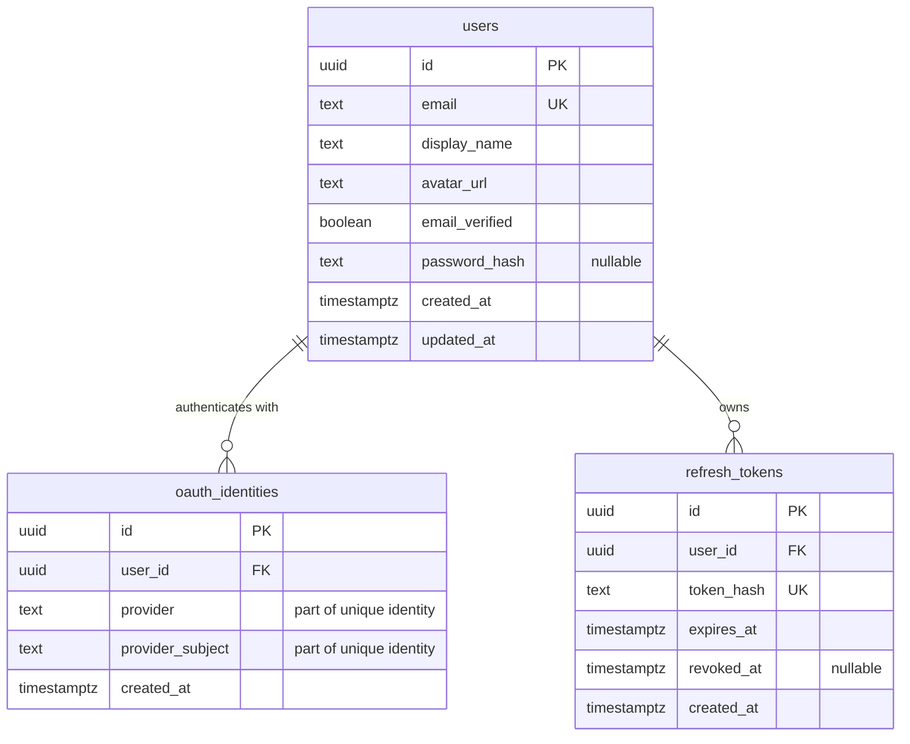

# Bint Backend

Go backend for Bint using Gin, Fx, PostgreSQL, and sqlc.

## Local setup

1. Copy `.env.example` to `.env` and set a random `JWT_SECRET` plus Google OAuth
   web-client credentials.
2. In Google Cloud, register
   `http://localhost:8080/api/v1/auth/google/callback` as an authorized redirect
   URI, or use the value configured in `GOOGLE_REDIRECT_URL`.
3. Start PostgreSQL with `docker compose up -d`.
4. Apply the SQL files in `db/migrations` using your migration tool. The API
   does not run migrations automatically. `db/schema.sql` contains the
   canonical current schema used by sqlc and schema-inspection tools.
5. Run `go run ./cmd/api`.

The OpenAPI document is available at `http://localhost:8080/openapi.yaml` and
the Scalar UI at `http://localhost:8080/docs`.

## Database schema

[`db/schema.sql`](db/schema.sql) is the canonical snapshot of the current
PostgreSQL schema. Keep it synchronized with the ordered migration files in
[`db/migrations`](db/migrations). The application does not apply either file
automatically.



The database has one central account record in `users`. Authentication methods
attach to that account: a password is stored on the user for email login, an
`oauth_identities` row enables Google login, and `refresh_tokens` rows represent
renewable login sessions. A user can therefore be Google-only, email-only, or
have both methods attached to the same account.

### `users`

This is the root account table. Other authentication records reference its
primary key.

| Field | Type and constraints | Meaning |
| --- | --- | --- |
| `id` | `UUID`, primary key, default `gen_random_uuid()` | Internal application user ID generated by PostgreSQL. External providers never use this as their identity. |
| `email` | `TEXT`, required, unique | Normalized login/contact email. The unique constraint prevents two local accounts from using the same email. |
| `display_name` | `TEXT`, required, default `''` | Name displayed by the application. An empty string means that no name has been supplied. |
| `avatar_url` | `TEXT`, required, default `''` | Profile-image URL. It may be populated from Google; an empty string means no avatar. |
| `email_verified` | `BOOLEAN`, required, default `FALSE` | Whether the email has been verified. A verified Google identity sets this to `TRUE`. Email registration currently leaves it `FALSE` because email verification is not implemented yet. |
| `password_hash` | `TEXT`, nullable | One-way password hash used for email authentication. It is `NULL` for a Google-only account. Plain-text passwords must never be stored here. |
| `created_at` | `TIMESTAMPTZ`, required | Timestamp at which the account was created. |
| `updated_at` | `TIMESTAMPTZ`, required | Timestamp of the latest persisted account update. |

The nullable `password_hash` is what allows multiple authentication shapes:

- Email-only user: `password_hash` is present and there may be no
  `oauth_identities` row.
- Google-only user: `password_hash` is `NULL` and a Google
  `oauth_identities` row exists.
- User with both methods: `password_hash` is present and a Google identity
  points to the same `users.id`.

### `oauth_identities`

This table maps an identity owned by an OAuth provider to one internal Bint
user. It deliberately separates the external identity from the `users` table,
so more providers can be supported later without adding provider-specific
columns to every user.

| Field | Type and constraints | Meaning |
| --- | --- | --- |
| `id` | `UUID`, primary key, default `gen_random_uuid()` | PostgreSQL-generated internal ID for this mapping row. It is not the Google user ID. |
| `user_id` | `UUID`, required, foreign key to `users.id` | The local Bint account that owns this external identity. Deleting the user cascades and deletes this mapping. |
| `provider` | `TEXT`, required | OAuth provider namespace. The current implementation writes `google`; keeping it as data allows providers such as Apple or GitHub to be added later. |
| `provider_subject` | `TEXT`, required | Provider's stable account identifier. For Google this is the OpenID Connect ID token's `sub` claim. It is not the email, access token, or authorization code. |
| `created_at` | `TIMESTAMPTZ`, required | Timestamp at which the external identity was linked to the local user. |

Two composite uniqueness rules protect the mapping:

- `UNIQUE (provider, provider_subject)` means one Google account can belong to
  only one Bint user. The provider is included because two different providers
  may issue the same subject string.
- `UNIQUE (user_id, provider)` means one Bint user can have at most one identity
  from a given provider. With the current implementation, a user cannot attach
  two different Google accounts.

Google login uses the table as follows:

1. Google verifies the person and returns an ID token. The backend validates
   that token and reads its `sub`, email, email-verification status, display
   name, and picture.
2. The backend first searches for `provider = 'google'` plus the returned
   `sub`. If found, `user_id` identifies the existing Bint account.
3. If that Google subject has never logged in, the backend looks for an existing
   user with the verified Google email. If one exists, it links the Google
   identity to that user; otherwise it creates a Google-only user.
4. The user creation/link and identity insertion run in one database
   transaction. The uniqueness constraints prevent one external account from
   being linked twice during concurrent requests.
5. After finding the local user, the application issues its own access JWT and
   refresh token. Google tokens are not used to authorize Bint API requests.

The `provider_subject` should be treated as the authoritative Google identity.
Using email alone would be unsafe because an email address is an attribute that
can change, while `sub` is the identifier Google assigns to the account for the
OAuth client.

### `refresh_tokens`

This table stores server-side state for refresh-token sessions. Access tokens
are JWTs and are validated cryptographically; they are not stored in this
table. Refresh tokens are opaque random values and can be revoked or rotated.

| Field | Type and constraints | Meaning |
| --- | --- | --- |
| `id` | `UUID`, primary key, default `gen_random_uuid()` | PostgreSQL-generated internal ID for the refresh-token record. |
| `user_id` | `UUID`, required, foreign key to `users.id` | User whose session owns the token. Deleting the user cascades and removes all of the user's refresh-token records. |
| `token_hash` | `TEXT`, required, unique | SHA-256 hash of the refresh token. Only the hash is stored, so a database read does not reveal a usable raw refresh token. |
| `expires_at` | `TIMESTAMPTZ`, required | Absolute time after which the refresh token is rejected. |
| `revoked_at` | `TIMESTAMPTZ`, nullable | Revocation time. `NULL` means it has not been revoked; a timestamp marks it unusable, including after logout or rotation. |
| `created_at` | `TIMESTAMPTZ`, required | Timestamp at which this refresh-token record was issued. |

The unique `token_hash` constraint prevents duplicate session tokens. The
`refresh_tokens_user_id_idx` index supports finding sessions by user, while
`refresh_tokens_expires_at_idx` supports expiry-based lookup or cleanup.

On refresh, the current row is locked, checked for both `revoked_at IS NULL` and
`expires_at > NOW()`, revoked, and replaced inside one transaction. This token
rotation prevents the same refresh token from being successfully reused.

### Deletion behavior

Both child tables use `ON DELETE CASCADE` through `user_id`. Deleting a user
therefore also deletes all linked OAuth identities and refresh-token records;
no authentication record is left pointing to a missing account.

## Development

```sh
make sqlc
make fmt
make test
```

`make sqlc` uses the pinned sqlc version from the Makefile and writes generated
code to `internal/adapter/postgres/sqlc`.
